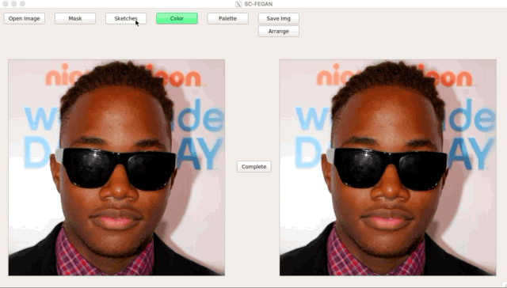

<<<<<<< HEAD
# FC-GAN
FC-GAN 기본 코드
=======
# SC-FEGAN
SC-FEGAN : Face Editing Generative Adversarial Network with User's Sketch and Color (ICCV 2019)

Youngjoo Jo, Jongyoul Park

arXiv: [https://arxiv.org/abs/1902.06838](https://arxiv.org/abs/1902.06838)



## Overview
Edit face images using a a deep neural network. Users can edit face images using intuitive inputs such as sketching and coloring, from which our network SC-FEGAN generates high quality synthetic images. We used SN-patchGAN discriminator and Unet-like generator with gated convolutional layers.


## Dependencies
- tensorflow
- numpy
- Python3
- PyQt5
- opencv-python
- pyyaml

## Setup
First, download the model from [Google drive](https://drive.google.com/open?id=1VPsYuIK_DY3Gw07LEjUhg2LwbEDlFpq1).

Run these commands to start the program.
  ```
  mv /${HOME}/SC-FEGAN.ckpt.* /${HOME}/ckpt/
  python3 demo.py
  ```
  
Select the number of GPUs you want to use by editing `demo.yaml` file (multi-GPUs are not supported).
  ```
  GPU_NUM: 1 (the number you want to use)
  #GPU_NUM: (if you want to use only CPU, erase the number)
  ```

## How to Use
Edit face images using a simple GUI. Only erased regions of the image are filled in by the network.

Explanation of the buttons:

- `Open Image`: Open the image you want to edit.
- `Mask`: Draw a mask on the desired regions of the face on the left viewer.
- `Sketches`: Sketch the desired lines on the left viewer.
- `Color`: Draw colored lines. If you click this button the first time, you have to choose a color from the palette.
- `Palette`: Change color. After choosing a color, click the `Color` button to apply the change.
- `Save Img`: Save the results. It is saved as '*name.jpg*'.
- `Arrange`: Arrange the editing works.
- `Undo`: Undo previous editing work.
- `Complete`: Generate the image and show it on the right viewer.

  
We recommend using the following workflow:
  ```
  1. Draw the sketch plausibly referring to the original image.
  2. Draw the mask on the sketched region.
  3. Click the `Arrange` button.
  4. Draw the color on the masked region.
  5. Click `Complete'.
  ```  

## Example Results
### Face editing


### Edit earring


### Face restoration


### Face restoration (with only sketch and color)


## License
CC 4.0 Attribution-NonCommercial International

The software is for educational and academic research purpose only.

## Notes

- This is developed on Linux machine running Ubuntu 18.04.1
- Provided model and sample code is under a non-commercial creative commons license.

## Citing
```
@InProceedings{Jo_2019_ICCV,
  author = {Jo, Youngjoo and Park, Jongyoul},
  title = {SC-FEGAN: Face Editing Generative Adversarial Network With User's Sketch and Color},
  booktitle = {The IEEE International Conference on Computer Vision (ICCV)},
  month = {October},
  year = {2019}
}
```

## Next
- Update training code

## Acknowledgement
We acknowledge the official code [DeepFillv1](https://github.com/JiahuiYu/generative_inpainting). We thank all the researchers at ETRI, especially Kimin Yun and Jinwoo Jung, for insightful discussions.
>>>>>>> d228063 (first commit)
